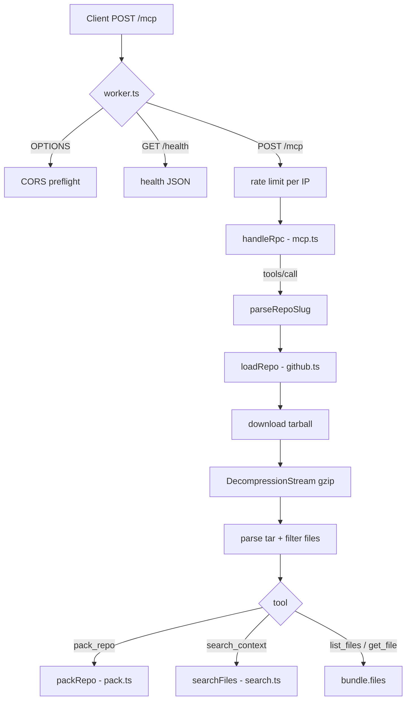

# Architecture

`ctx.vanshul.com` is a single Cloudflare Worker exposing a Model Context Protocol
(MCP) server that turns a GitHub repository into agent-ready context. No database,
no LLM — the pipeline is deterministic and has **zero runtime dependencies**.

## Request lifecycle

## Modules (`src/`)

| File | Responsibility |
| --- | --- |
| `worker.ts` | HTTP entry: routes `/mcp`, `/health`, static assets; CORS; per-IP rate limit; batch. |
| `mcp.ts` | JSON-RPC 2.0 dispatch and the four tool definitions. |
| `github.ts` | Fetch the repo tarball, gunzip, parse the tar in-process, filter files; short-lived cache. |
| `pack.ts` | Concatenate files into one blob with headers; token estimate + budget. |
| `search.ts` | Rank passages (blocks of non-blank lines) against a query, with file + line. |

## Loading a repo

1. `parseRepoSlug` turns `owner/repo`, `owner/repo/ref` or a github.com URL into
   `{ owner, repo, ref? }`. Input is **always** a slug we control, so the fetched
   URL is always `api.github.com/repos/{owner}/{repo}/tarball[/{ref}]` — no SSRF.
2. `download` streams the response through `DecompressionStream('gzip')` and reads
   it with an uncompressed size cap.
3. `parseTar` is a minimal, dependency-free tar reader: it walks 512-byte blocks,
   parses octal sizes, resolves ustar `prefix` + `name`, and handles GNU long
   names (`L`) and pax extended paths (`x`); global pax headers (`g`) are skipped.
4. `filterEntries` strips the leading `owner-repo-<sha>/` directory (also used to
   resolve the default `ref`), then drops build/noise directories, lockfiles,
   known binary extensions, oversized files and any file containing NUL bytes.

Results are cached per-isolate for ~5 minutes keyed by `owner/repo@ref` + globs,
so `list_files` → `search_context` → `get_file` on the same repo fetch once.

## Packing & searching

- `packRepo` writes a header then one `==== path ====` section per file, stopping
  when the running token estimate exceeds `max_tokens` (always includes ≥1 file).
- `searchFiles` splits each file into blocks (runs of non-blank lines), scores by
  case-insensitive term frequency, windows each snippet around the first match,
  and returns the top matches with `path`, `line` and `score`.

Token estimate is the standard ~4-chars-per-token heuristic — labelled an estimate.

## Limits

| Concern | Value | Where |
| --- | --- | --- |
| Rate limit | 30 req/min/IP | `worker.ts` |
| Download timeout | 20 s | `github.ts` |
| Uncompressed cap | ~60 MB | `github.ts` |
| Per-file cap | 512 KB | `github.ts` |
| File-count cap | 3000 | `github.ts` |
| Cache TTL | 5 min/isolate | `github.ts` |
